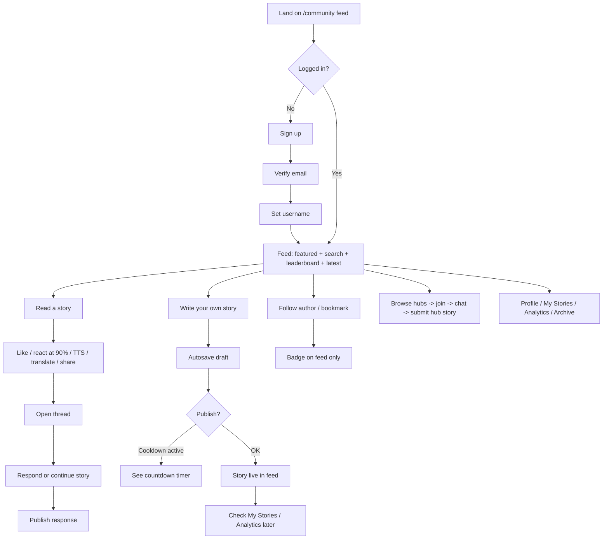
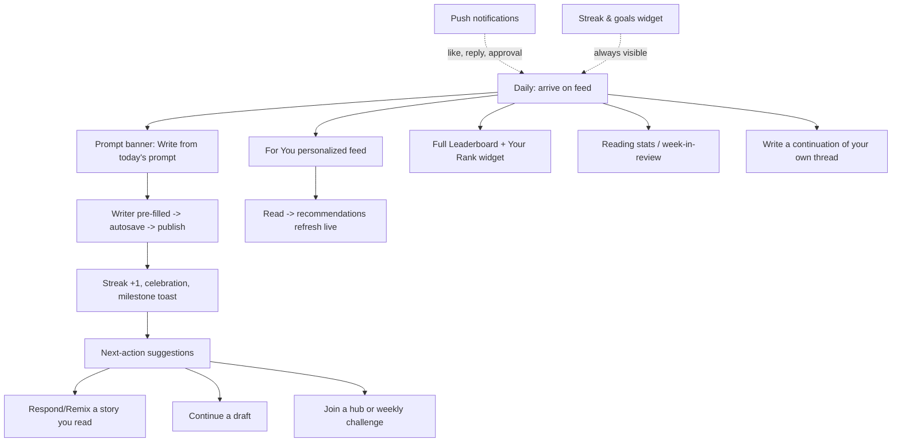

# CALM-WRITER — Feature Status, Gaps & Roadmap

> A calm, minimalist writing & reading platform (Node/Express + React/Vite, MongoDB).
> This report covers: (1) what exists today, (2) incomplete / needs-change items,
> (3) future feature ideas, (4) the current user flow with the exact points where it
> breaks, and (5) how to make the loop continuous instead of monotonous.

---

## 1. Executive Summary

The product is **functionally complete as an MVP** — auth, publishing, reading,
threads, hubs, moderation, and admin all work end-to-end. The weaknesses are **not
in raw functionality but in the journey around it**.

### What shipped since this report was written (see §2.1 update)

The "orphaned/backend-only" features are now surfaced in the UI:

- **Daily prompts → writer pipeline** (F1): `PromptBanner` on the feed calls
  `GET /prompts/current`, and "Write from this prompt" opens the writer **pre-filled**
  with the prompt text (`localStorage` bridge + `WriteScreen` prefill).
- **Full leaderboard page** (F2): `/leaderboards` with the four lenses
  (Top Stories + period tabs, Most Felt, Quietly Powerful, Growing Stories) and a
  "View all leaderboards →" link from the sidebar widget.
- **"For You" feed** (F6, part): new feed tab backed by `GET /stories/for-you`
  (follows > read-history > recency) plus inline **writer suggestions** on cold start.
- **Onboarding checklist** (F7): 4-step checklist (verify email → write first story →
  follow a writer → join a hub) rendered on the feed for new users, driven by
  `GET /users/onboarding`.
- **Writing streak widget** (F9, part): sidebar widget showing current streak,
  today's words, totals, and stories read, driven by `GET /users/stats`.
- **Inline report modal** (F14, part): `ReportModal` component built (posts to
  `POST /admin/report`) but **not yet wired into feed cards** — ThreadView keeps its
  own report flow.

Remaining gaps are the same as before: the 12h-cooldown dead zone (F8) has no
redirect/next-action UI, milestones/celebrations are absent, and the streak widget
shows approximate 14-day dots rather than a true data-backed heatmap or settable
daily goal.

---

## 2. Current State — Full Feature Inventory

### 2.1 Everything that works today (verified)

| Area | What works |
| --- | --- |
| **Auth** | Register, login, refresh, logout, session invalidation, email verification + resend, OTP password reset, username setup, device/session management |
| **Stories** | Publish, edit (5-min grace, max 3 edits), delete (30-min grace), 20k-word cap, 12h publish cooldown, likes, bookmarks, read-tracking |
| **Threads** | Reader responses, author continuations, moderator pin/lock, edit requests (request + approve) |
| **Reactions** | Unlocked only after reading ≥90% of a story (anti-gaming design) |
| **Feed** | Latest / trending / most-liked / **For You** / following sorts, featured banner, embedded search, embedded leaderboard widget, **daily prompt banner**, **onboarding checklist** |
| **Drafts** | Autosave, draft panel (save / load / delete / publish) |
| **Hubs** | Create (1-story eligibility), invites, join requests, hub chat, hub stories with approval, creator applications, open/approval-only membership |
| **Engagement** | Follows, bookmarks page, notifications page, polled unread badge (feed only) |
| **Discovery** | Feed search, user profiles, story pages |
| **Translation** | On-demand language picker, cached translations, translated reading |
| **Read-aloud (TTS)** | `useSpeech` hook wired into both story cards and the reader |
| **Analytics** | Writer dashboard (reads, likes, reactions, drop-off) |
| **Moderation** | Reports, appeals, timeout appeals (review/confirm/cancel), moderator chat, remove/hide content, pin/lock threads |
| **Admin** | Stats, user management, moderation stats, content oversight |
| **PrivateArchive** | Save/restore archived stories |
| **Weekly Featured** | Scheduler job picks top story by likes, sets `isFeatured`, archives history, banner reads it |
| **Daily prompts** | `PromptBanner` on the feed (`GET /prompts/current`); "Write from this prompt" prefills the writer |
| **Streak widget** | Sidebar widget (`GET /users/stats`): current streak, today's words, totals, stories read |
| **Onboarding checklist** | 4-step guided first-steps on the feed for new users (`GET /users/onboarding`) |
| **Leaderboards page** | `/leaderboards` — Top Stories (+24h/3d/1w/all-time) and the three lensed boards |
| **Uploads** | MinIO image uploads |
| **Settings** | Preferences, profile editing |
| **Security** | Rate limiting, CSRF, input sanitization, JWT, RBAC, request logging, response standardization |

### 2.2 Incomplete, orphaned, or needs-change features

| # | Feature | Status today | What's missing / wrong | Impact |
| --- | --- | --- | --- | --- |
| F1 | **Daily writing prompts** | ✅ Done | `PromptBanner` (feed) + `fetchDailyPrompt()` wired; "Write from this prompt" prefills the writer via `localStorage`. `GET /prompts/current` already existed. | Closed |
| F2 | **Leaderboard lenses** | ✅ Done | Full `/leaderboards` page uses all four lenses (`top-stories` w/ periods, `most-felt`, `quietly-powerful`, `growing-stories`); sidebar widget links to it. "Your rank" callout not built. | Mostly closed |
| F3 | **Direct moderator actions** | Partial | Moderation UI handles report actions and **timeout appeals**, but issuing a warning / timeout directly from a report is not surfaced (the `timeoutUser` / `issueWarning` helpers were removed as unused imports). | Medium — moderators can't act in one click |
| F4 | **Email delivery** | Dev-fallback | Without SMTP, verification/reset "emails" are logged to console (OTP shown there). No branded templates, no send queue/retry. | Medium — breaks the signup loop in real deployments |
| F5 | **Notifications** | Partial | Only follow / like / edit-request triggers; unread badge polled **only on the feed** every 30s; no real-time push, no cross-app badge, no per-type filtering. | Medium |
| F6 | **Personalization** | Partial → mostly done | **For You feed shipped** (new tab using `GET /stories/for-you` + writer suggestions). `ReadSession` still doesn't power a user-facing **reading stats page** (only totals shown in the streak widget). | Mostly closed |
| F7 | **Onboarding** | ✅ Done | `OnboardingChecklist` on the feed: verify email → write first story → follow a writer → join a hub, with progress bar; imports `GET /users/onboarding`. | Closed |
| F8 | **Post-publish feedback** | Missing | After publishing, the user is left with no celebration, no next-action suggestions, and the 12h cooldown means they literally cannot continue publishing. No redirect to constructive alternatives (respond, draft, hub, prompt). | High — monotony driver |
| F9 | **Streaks / goals / rewards** | Partial | `StreakWidget` shipped (current/best streak, today's words, totals, stories read via `GET /users/stats`). No settable daily goal, no true data-backed heatmap (approximate 14-day dots), no milestone celebrations. | High — core mechanic mostly in |
| F10 | **Hub discoverability** | Weak | No hub marketplace / browse; hubs are reached only by direct navigation or invite. No "join hub" discovery in the feed. | Medium |
| F11 | **Mobile / offline** | Missing | Desktop-only experience; no PWA manifest, no offline drafts, no `OfflineIndicator` (deleted as dead). | Medium |
| F12 | **Translation reliability** | Weak | Free Google endpoint (rate-limited, unofficial). No API-key/paid path, no per-language stats or fallback beyond cache. | Low |
| F13 | **`canCreateHubs` gating** | Inconsistent | Eligibility check (`check-eligibility`) only counts published stories; the `canCreateHubs` flag set by approved creator applications isn't consulted at hub creation. | Low |
| F14 | **Report reachability** | Partial | `ReportModal` component built (posts `POST /admin/report`) but **not wired into feed cards**; ThreadView has its own report flow. | Low — one wiring step away |

---

## 3. Deep Dive — the features that need changes

### 3.1 F1 — Daily Prompts (backend only → resurrect) — ✅ SHIPPED

- `fetchDailyPrompt()` → `GET /prompts/current` (already existed; was just missing a caller).
- `PromptBanner` on the feed; "Write from this prompt" stores the prompt in
  `localStorage` and routes to `/write`, where `WriteScreen` prefills the textarea.
- Not built: `DailyPrompt.usedBy` rotation tracking (backend still self-rotates via
  `order`).

### 3.2 F2 — Leaderboard lenses (API only → full page) — ✅ SHIPPED

- `/leaderboards` page renders all four lenses (`top-stories` with 24h/3d/1w/all-time
  period tabs, `most-felt`, `quietly-powerful`, `growing-stories`), reusing the
  `leaderboard__row` style. Rows navigate to `/story/:id`.
- Sidebar widget gained a "View all leaderboards →" link (`Leaderboard onViewAll`).
- Not built: "your rank" callout (requires knowing the requesting user's position).

### 3.3 F3 — Direct moderator actions (one-click moderation)

Add the warning / timeout actions to the report-action modal so a moderator can:
**Remove content → optionally warn → optionally timeout (12h/24h/7d)** in one dialog,
backed by the existing `ModAction` model and `moderation.js` endpoints. Wire the
`timeoutUser` / `issueWarning` helpers back into `ModerationDashboard.jsx`.

### 3.4 F4 — Email reliability

- `.env` support for a real SMTP provider (SES/SendGrid/Resend) + HTML templates.
- Console fallback stays for dev (with a clear warning).
- Add a lightweight retry/send-queue; mark emails as `sentAt` on the user for audit.

### 3.5 F5–F6 — Notifications & personalization (data → product)

- **Notifications**: add triggers (thread reply, hub story approved, hub join accepted,
  follow approved), a global bell with badge across all pages (lift the poll out of
  `CommunityFeed`), per-type filter, and read/unread. — *not started*
- **Personalization**: a **"For You" feed shipped** — a new `CommunityFeed` tab backed
  by `GET /stories/for-you` (follows → read history → recency) plus writer suggestions
  on cold start. Remaining: a "reading stats" page (hours read, stories finished,
  authors followed). The streak widget shows stories-read as a stopgap. — *mostly done*

### 3.6 F7–F9 — Habit loop (the core of the "continuous flow" ask)

**Shipped this round:** the onboarding checklist (F7) and the streak widget (F9 part).

- **F7 ✅** `OnboardingChecklist` renders on the feed for users with unfinished steps:
  verify email → write first story → follow a writer → join a hub, with a progress
  bar tapping `GET /users/onboarding`.
- **F9 ‣** `StreakWidget` in the sidebar shows current/best streak, today's words,
  totals and stories read from `GET /users/stats`, with a 14-day dot strip.
  **Not built:** settable daily goal, a true data-backed heatmap (the dots are
  approximations drawn from streak state, not per-day history), and milestone
  celebrations.
- **F8 not started:** post-publish next-actions and the cooldown redirect that would
  close the 12h dead zone.

### 3.7 F13 — Hub creation gating

In `HubCreation`, when `checkEligibility()` returns eligible, also pass
`user.canCreateHubs`; block the form and show a "apply to become a hub creator"
CTA when the flag is false and there are no approved applications.

---

## 4. Current User Flow — Diagram & Break Points

### 4.1 What the user does today

### 4.2 Where the flow breaks (mapped to the diagram)

| # | Point | What breaks | Feeling for the user | Fix (see §5) |
| --- | --- | --- | --- | --- |
| BP1 | After `E` (username setup) | Onboarding silently ends | "Empty feed, what do I do first?" | ✅ Onboarding checklist shipped (F7); first-story CTA + follow suggestions in the For You tab |
| BP2 | `F → L` (write) | No bridge from reading to writing except manually going to Write | "I read, but nothing pulls me to write" | ✅ Prompt banner "Write from this prompt" prefills the writer (F1). "Respond / Remix this story" still not built |
| BP3 | `N → O` (cooldown dead zone) | After publishing, nothing to do for 12h | "I can't keep going" | ❌ Not built — redirect to constructive next actions (respond, draft, hub, prompt) remains open (F8) |
| BP4 | `Q` (post-publish feedback) | Likes/reactions/reads invisible in real time; no celebration | "Did anyone read it?" | ❌ Not built — no milestone celebrations; notifications still feed-only |
| BP5 | `F` (discovery) | Same 3 sorts; rich leaderboard lenses and ReadSession data unused | "Same stories every day" | ✅ For You feed tab + writer suggestions shipped (F6); full `/leaderboards` page shipped (F2) |
| BP6 | `T` (hubs) | No marketplace; hubs only via direct path/invite | "I didn't know hubs existed" | ❌ Not built — hub browse/discovery remains (F10) |
| BP7 | whole journey | No habit scaffolding: no streak, goals, heatmap, prompts | "Nothing calls me back tomorrow" | ✅ Streak widget + daily prompt shipped (F9 part, F1). Goals/heatmap/milestones remain (F9, F8) |

---

## 5. Future Continuous Flow — Making it non-monotonous

### 5.1 Target flow (what to build toward)

### 5.2 Anti-monotony feature set (ranked by effort → value)

| Priority | Feature | What it does to the loop | Effort |
| --- | --- | --- | --- |
| P0 | **Daily prompt → writer** (F1) | Gives everyone a daily reason to open & write | ✅ Done |
| P0 | **Post-publish next-actions + cooldown redirect** (F8) | Kills the 12h dead zone — always a next move | ❌ Open |
| P0 | **Onboarding checklist** (F7): verify email → write first story → follow 3 authors → join a hub | Guides cold-start users into the habit | ✅ Done |
| P0 | **Streak + daily goal + writing heatmap** (F9) | The core "come back tomorrow" mechanic | ‣ Partial (streak widget in; goal/heatmap open) |
| P1 | **Milestone celebrations** (F9): first like, 100 reads, 1000 words, first response | Immediate feedback after publish (BP4) | ❌ Open |
| P1 | **"For You" feed** (F6) | Personalized discovery from existing ReadSession data | ✅ Done |
| P1 | **Full leaderboard page** (F2) + your rank | Adds a light competitive pull + uses built APIs | ‣ Done; your-rank callout open |
| P1 | **Reading stats / week-in-review** (F6) | Turns collected data into user value | ❌ Open (streak widget shows totals as stopgap) |
| P1 | **Global notification bell + more triggers** (F5) | Real-time engagement (BP4) | ❌ Open |
| P2 | **Hub marketplace / discovery** (F10) | Makes collaboration findable | Medium |
| P2 | **PWA + offline drafts** (F11) | Writing anywhere, drafts survive offline | Medium |
| P2 | **Weekly/themed writing challenges** | Seasonal goal posts so the loop doesn't stale | Medium |
| P2 | **Direct mod actions** (F3), **SMTP emails** (F4), **canCreateHubs gating** (F13), **inline reports** (F14) | Operational hardening | Low |
| P3 | **Translation via paid key** (F12) | Reliability | Low |
| P3 | **Series / collections / categories, import-export (Markdown/PDF), dark mode, i18n** | Polish & power-user features | Medium |

---

## 6. Suggested Roadmap (phases)

| Phase | Scope | Outcome |
| --- | --- | --- |
| **1 — Fix the loop (this sprint)** | P0: prompt banner ✅, next-actions + cooldown redirect ❌, onboarding checklist ✅, streak widget ✅ (goal + heatmap still ❌) | A user who arrives daily has an always-clear next action; monotony solved at its root |
| **2 — Surface what exists** | F2 leaderboard page ✅, F5 notification bell + triggers ❌, F6 For You feed ✅ + reading stats ❌, P1 celebrations ❌ | Every feature currently orphaned/partial becomes visible & valued |
| **3 — Personalize** | F6 "For You" feed ✅, hub discovery (F10) ❌, weekly challenges ❌ | Discovery stops being a flat wall of the same 3 sorts |
| **4 — Hardening & polish** | F3/F4/F12/F13/F14 (modal built, not wired), PWA offline, import/export, dark mode, i18n | Operational and platform completeness |

---

## 7. Quick reference — everything in one table

| Feature | Present? | Complete? | Needs change? | Future add? |
| --- | --- | --- | --- | --- |
| Auth + sessions + email verify | Yes | ✅ | Email/SMTP (F4) | — |
| Publish / edit / delete / cooldown | Yes | ✅ | Cooldown UX → next-actions (F8) | — |
| Feed + search + featured | Yes | ✅ | Personalization (F6) | "For You" feed ✅ |
| Drafts autosave | Yes | ✅ | — | PWA offline drafts |
| Threads + responses + continuations | Yes | ✅ | — | "Remix/Respond" CTA (BP2) |
| Reactions (90% unlock) | Yes | ✅ | — | Author reaction analytics |
| Likes / bookmarks / follows | Yes | ✅ | Notifications depth (F5) | — |
| Leaderboard widget (top-10 likes) | Yes | ✅ | — | Full lensed page (F2) ✅ |
| Leaderboard lenses API | Backend only | ✅ Shipped | — | Your-rank callout |
| Daily prompts | Backend only | ✅ Shipped | — | Prompt → writer pipeline ✅ |
| For You feed (ReadSession) | Data only | ✅ Shipped | — | Reading stats page (F6) |
| Translation | Yes | Partial | Paid key (F12) | Auto-suggest |
| Read-aloud TTS | Yes | ✅ | — | Listening mode |
| Hubs (chat, approvals, creators) | Yes | ✅ | canCreateHubs gating (F13) | Marketplace (F10) |
| Analytics (writer) | Yes | ✅ | — | Read-time, drop-off depth |
| Moderation + admin | Yes | Partial | Direct warn/timeout (F3), inline reports (F14 — modal built, not wired) | ML-assisted flagging |
| PrivateArchive | Yes | ✅ | — | — |
| Reading stats (ReadSession) | Data only | ✅ For You feed; stats partial | User-facing stats page (F6) | Week-in-review |
| Notifications | Yes | Partial | More triggers + global bell (F5) | Push / real-time |
| Onboarding | Minimal | ✅ Checklist shipped | — | Guided tour |
| Streaks / goals / heatmap | Streak widget only | Partial | Daily goal + real heatmap (F9) | Milestones (P1) |
| Celebrations / milestones | No | — | — | P1 |
| Writing challenges | No | — | — | P2 |
| PWA / offline | No | — | — | P2 |
| Dark mode / i18n / export | No | — | — | P3 |
